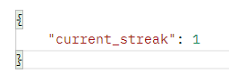
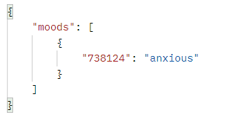

# Mood Tracker API

Charts inputted moods from user by day. Also calculates streak for consecutive days of mood submissions.

Created in Python using Flask framework.

## Authorization

Login functionality is implemented using a Basic HTTP authentication where the user sends their username and password with every request sent to be authenticated.

For testing sake, the credentials 'adminUsername' and 'adminPassword' should be supplied to be able to access protected functions, like getting and posting moods.

## Endpoints

There are 5 valid moods a user can input to describe their current state: "angry", "anxious", "happy", "sad", and "tired". Any other inputted mood is invalid.

### **POST** /mood

Adds a new mood from the user for the day/time created.

### **GET** /mood

Gets all moods submitted by the user.

## Responses
In the body of the response for the ‘/mood’ endpoint, the number of consecutive days the user inputted moods, or the mood "streak" is returned as seen in the following:

>

The following is a sample response from the mood/ endpoint, when the mood "anxious" has been POSTed already:
>**GET mood/**
>
>

"73814" is the date the user inputted the mood "anxious", but converted to proleptic Gregorian ordinal date, explained [here](https://www.geeksforgeeks.org/python-datetime-toordinal-method-with-example/), which was converted in order to account for a mood streak spanning multiple months and years.

## Examples

**If user has properly authenticated their credentials:**

To submit a mood, the following format is required for a /mood POST request:
> **POST /mood**
>
> { "mood": "insertmoodhere"}

## Notes

If this were not an assessment and was intended for production, I would go an entirely different route for authentication, with implementing a database of some kind to store usernames and passwords, most likely SQL. Anticipating a high volume of users, my current login method would be insufficient to handle the size and creation of many new users, and is uncapable of properly securing sensitive data like that of health-related information. 

Using a SQL database with something like the Flask-Login library would allow a lot more breathing room in maintaining the database of user information and mood data, like hashing passwords for security, or enabling users to login using emails.

Ideally, I would like to add a wider range of moods for the user to choose from, or have a choice between preselected moods and a numbered scale. Allowing the user to submit notes relating to their chosen mood, like a diary entry, could also be an interesting feature. Having the date be outputted to the user in standard readable form would also be a change.